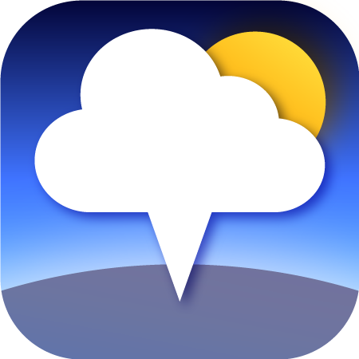
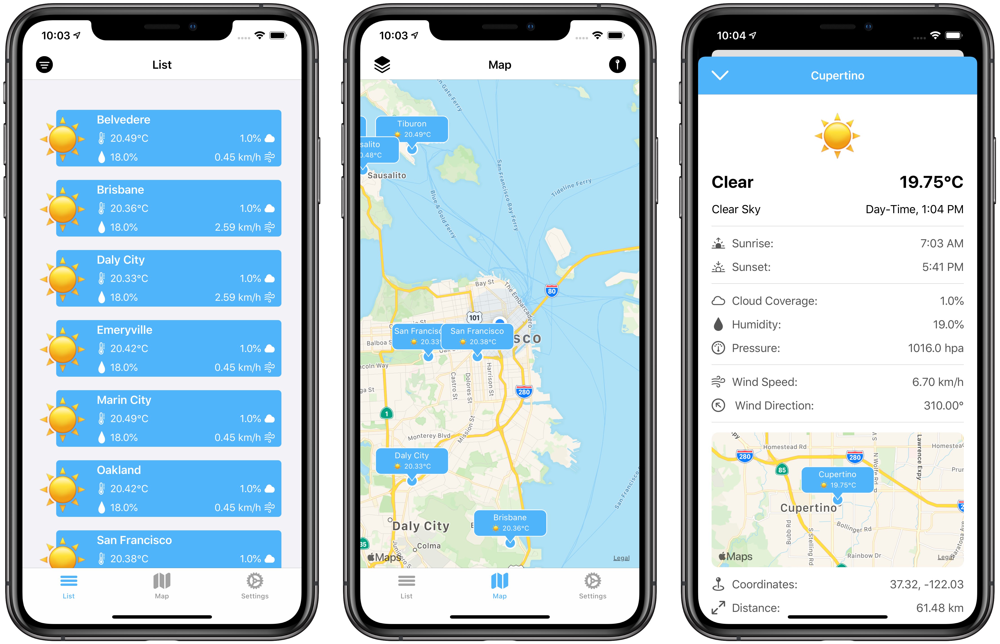

<p align="center">

</p>

<h1 align="center">NearbyWeather - OpenWeatherMap Client</h1>

<p align="center">
  <a href="#about-the-app">About the App</a> •
  <a href="#mission-of-this-project">Mission of this Project</a> •
  <a href="#app-releases">App Releases</a> •
  <a href="#how-to-get-started">How to Get Started</a> •
  <a href="#how-to-contribute">How to Contribute</a> •
  <a href="#support--feedback">Support & Feedback</a> •
  <a href="#licensing">Licensing</a>
</p>

---

<p align="center">
  
<a href="https://developer.apple.com/swift/"></a>
<a href="https://github.com/erikmartens/NearbyWeather/commits/develop" title="Latest Commit"></a>
<a href="https://github.com/erikmartens/NearbyWeather/issues" title="Open Issues"></a>
<a href="https://github.com/erikmartens/NearbyWeather/graphs/contributors"></a>

</p>
<p align="center">
<a href="https://itunes.apple.com/app/nearbyweather/id1227313069"></a>
</p>

<p align="center">

</p>

## About the App

> ❗️ By using the app you automatically agree to the [privacy policy](PRIVACYPOLICY.md) and the [terms of use](TERMSOFUSE.md).

> ❗️Please note that you need to supply your own OpenWeatherMap API key, in order to use the app.

NearbyWeather is a simple weather app, that provides current weather information for nearby cities, as well for bookmarked locations. NearbyWeather uses the OpenWeatherMap API to download weather data. Additionally the OpenWeatherMaps location database is directly bootstrapped into the app for quick access.

With NearbyWeather you can:

- See current weather information for bookmarked and nearby places via a list and a map view
- See the current temperature on your app icon
- Detailed weather information is offered in addition to the overviews
- Add places as bookmarks via OpenWeatherMaps weather-station data base
- Choose your preferred units (celsius/fahrenheit/kelvin & kilometres/miles)
- Access previously loaded data offline

## Mission of this Project

NearbyWeather was created to help you as a reference for developing your skills. The app is kept up to date with the latest best practices in mobile app development. Find out how how modern iOS apps are engineered:

| Area | Concepts | Status |
|:--|:--|:-:|
| Languages | Swift, Objective-C, JavaScript | ✅ |
| Frameworks | RxSwift, RxFlow | ✅ |
| Architecture | MVVM+C | ✅ |
| UI-Construction | Autolayout in Code + Factory Pattern | ✅ |
| Dependency Management| Swinject | ✅ |
| Data Persistence | Realm, Files on Disk & UserDefaults | ✅ |
| Networking | Alamofire | ✅ |
| Asset Management | R.Swift | ✅ |
| Code Quality | SwiftLint | ✅ |
| Analytics and Reporting | Google Firebase | ✅ |
| Package Management | CocoaPods | ✅ |
| Bootsrapping | Node.js Scripts | ✅ |
| Deployment | Fastlane | ✅ |
| Developer Sanity | SwiftUI Scene Previews | 🅾️ |
| Analytics | Ananymous Usage Behavior | 🅾️ |
| Continuous Integration | Bitrise | 🅾️ |
| Testing & Quality Assurance | Unit Tests & UI Tests, SwiftUI Scene Previews | 🅾️ |

__LEGEND:__ ✅ Done, 🔄 In Progress, 🅾️ Coming Soon

## App Releases

Past releases are documented in the [release section](https://github.com/erikmartens/NearbyWeather/releases) of this repository. Future releases are planned via the [project board](https://github.com/erikmartens/NearbyWeather/projects). There you can get an overview of planned features. If you want to suggest a feature, you can submit a new issue for triage.

| Version | Tag |
|:--|:--|
| Current Release | [v2.3.0](https://github.com/erikmartens/NearbyWeather/releases/tag/v2.3.0)
| Next Release | [v2.4.0](https://github.com/erikmartens/NearbyWeather/projects/8) |
| Future Releases | [v?.?.?](https://github.com/erikmartens/NearbyWeather/projects) |

## How to Get Started

1. Install the latest version of Xcode from the Mac AppStore
2. Install the latest Xcode command line tools
    ```
    xcode-select --install
    ```
3. Install [CocoaPods](https://cocoapods.org) to your machine
4. Install [fastlane](https://docs.fastlane.tools/getting-started/ios/setup/) to your machine
5. Install [SwiftLint](https://github.com/realm/SwiftLint/#installation) to your machine
6. Fork the project and clone it to your local machine
7. Configure signing via [fastlane match](https://docs.fastlane.tools/actions/match/) to use your personal certificates
7. Run `pod install` to be able to build locally

## How to Contribute

### Development

We looking forward to receiving your contributions. You can find out how to take part in the development of this application. Please find out how to submit code to this repository via the [contribution guidelines](CONTRIBUTING.md).

### Translations

Localizing the app for additional languages is another great way to contribute. If you are an experienced iOS developer, you know what to do. Please create an issue for your chosen language and follow the [contribution guidelines](CONTRIBUTING.md). Otherwise get into contact in order to be introduced to the procedure.

### Beta Testing

You may also assist as a beta tester. Periodically test-builds will become available via Testflight. In order to take part in testing those submit an email address used as an Apple-ID to [erikmartens.dev@icloud.com](mailto:erikmartens.dev@icloud.com) to be added to the list of testers.

## Support & Feedback

If you are having technical issues or want to raise a bug/issue with the app, the preferred way is through [GitHub issues](https://github.com/erikmartens/NearbyWeather/issues). In order to contact Erik Maximilian Martens for any other request please reach out via one of the channels detailed in table below:

| Platform | Link |
|:--|:--|
| Discord | <a href="https://discord.gg/fxPgKzC"></a> |
| Twitter | <a href="https://twitter.com/erik_m_martens"></a> |
| Email | <a href="mailto:erikmartens.dev@gicloud.com" title="erikmartens.dev@icloud.com"></a> |

## Licensing

Copyright © 2016 - 2021 Erik Maximilian Martens.

Licensed under the **MIT License** (the "License"); you may not use this project except in compliance with the License.

You may obtain a copy of the License at [https://opensource.org/licenses/MIT](https://opensource.org/licenses/MIT).

Unless required by applicable law or agreed to in writing, software distributed under the License is distributed on an "AS IS" BASIS, WITHOUT WARRANTIES OR CONDITIONS OF ANY KIND, either express or implied. See the [LICENSE](./LICENSE) for the specific language governing permissions and limitations under the License.
